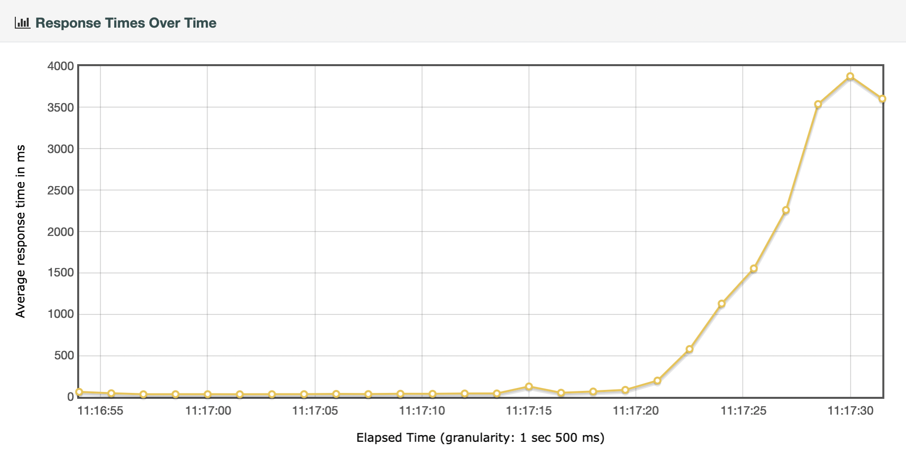
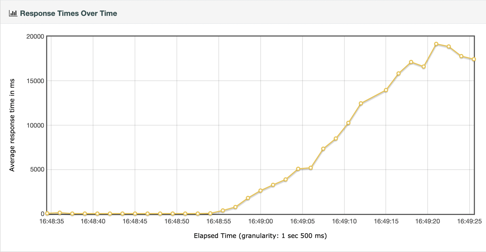
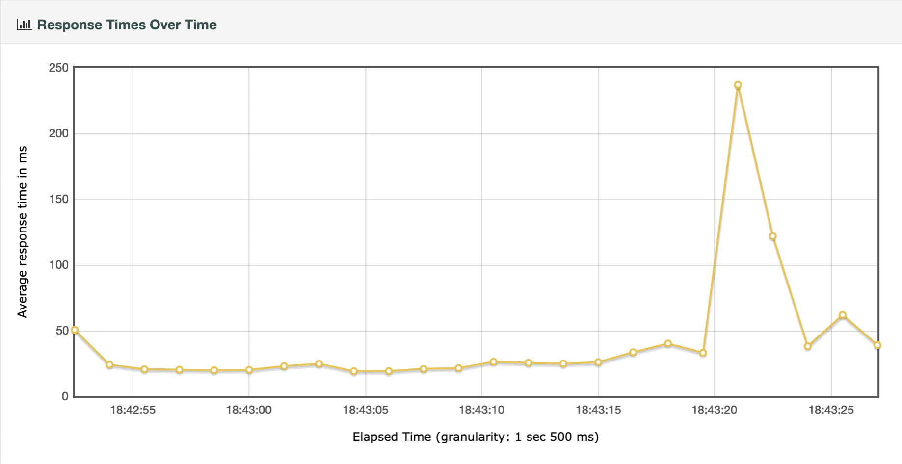
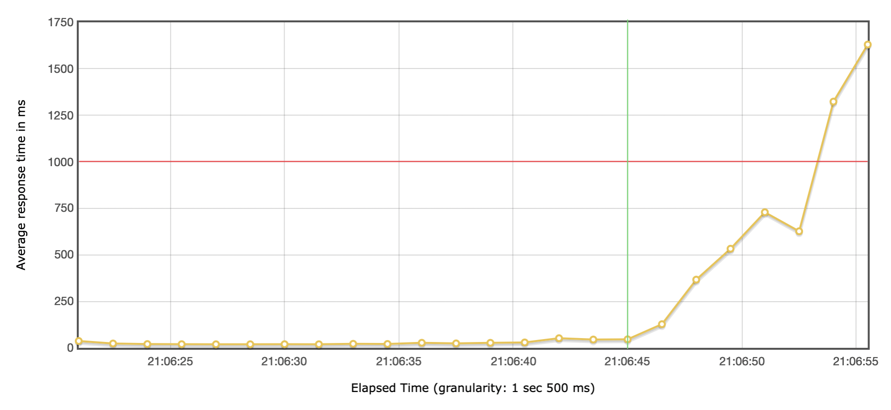

# InsideAirbnb

An app based on [insideairbnb](http://insideairbnb.com) that __does__ use https among other security & performance enhancements.

Using dotnet core 6 / 7 preview 2

* asp.net core backend
* blazor frontend

## To run API

1. Got to api subdir
2. copy `.env.example` to `.env` (and fill in the blanks)
3. copy `appsettings.json` to `appsettings.Development.json` (and fill in the blanks)
4. `docker compose up -d`
5. `dotnet run`

## Technical Requirements

### Must have

* Wordt gehost op het Azure Cloud Platform
* Maakt gebruik van ASP.Net Razor pages of MVC. Alleen in overleg met docent als er goede redenen zijn om hiervan af te wijken ✅ (blazor)
* Maakt gebruik van MSSQL Server (versie van Azure) ✅
* De applicatie moet veilig zijn. Gebruik de OWASP top 5 om de meest voorkomende onveiligheden op te sporen en af te dichten
* De applicatie is aantoonbaar highly-scalable. Er worden daarvoor performance tests als bewijsmateriaal opgeleverd (voor de performance-verbeteringen en daarna)
* Authenticatie en autorisatie via Azure B2C of IdentityServer4 (Authentication As A Service) ✅ (net core identity)
* Caching service via Redis ✅

### Would have

* Microservice architectuur
* Microservice orchestration met Kubernetes
* Blazor applicatie met SignalR ✅

## Functional Requirements

### Must have

* Registeren en inloggen ✅
* Filter op prijs ✅
* Filter op buurt ✅
* Filter op review ✅
* Kaart is clickable, details rechts op pagina, maakt gebruik van de mapbox API ✅
* Details per item waarop gefiltered is: #overnachtingen, #opbrengst in de maand. ✅
* Er moeten rollen toegevoegd en toegekend worden aan geregistreerde gebruikers. ✅
* Resultaten zoals trends, totalen, gemiddelden, etc. worden weergegeven in charts, alleen te bekijken voor ADMINS. Denk daarbij aan bv Gemiddelde beschikbaarheid per maand, gemiddelde beschikbaarheid per buurt, overzicht van gemiddelde huurprijs per buurt. Andere managementoverzichten zijn ook mogelijk, ga daarvoor op zoek naar online voorbeelden ✅

### Could have

* Locaties van zoekresultaat zichtbaar op kaart ✅
* Layout idem als insideairbnb.com ✅


## Architecture

De eerste opzet was een client-server architectuur, met een blazorserver frontend en een asp.net core backend (API). Later is hier vanaf geweken, nadat bleek dat dit eigenlijk een client-server-server architectuur was, en dit niet benodigd was voor de casus.

Uiteindelijk is één hoofdapplicatie, een blazorserver app, gebruikt voor de realisatie. Deployment is vervolgens gegaan via Docker, waarbij er containers zijn voor de volgende services:

* InsideAirbnb (blazorserver, .NET 6)
* Azure sql edge
* Redis


De database is een extensie op de bestaande azure-sql-edge image, waarbij de bacpac met data van insideairbnb.com toegevoegd wordt als een layer. Deze bacpac wordt vervolgens runtime uit het filesystem van de container gehaald d.m.v. de environment variable `MSSQL_PACKAGE`. Hierdoor hoeft ook geen volume gekoppeld te worden aan de container, want de content blijft iedere keer hetzelfde: uit de bacpac.

De docker images worden vervolgens automatisch gebouwd via [een pipeline op github actions](https://github.com/YVbakker/InsideAirbnb/actions). Dit gebeurt zowel 's nachts (`nightly`) als bij elke release en/of merge met de `main` branch. Er is vanuti de workflow support voor [semantic versioning](https://semver.org).

## Performance

Voor performance is [ASP.NET Core Blazor performance best practices](https://docs.microsoft.com/en-us/aspnet/core/blazor/performance?view=aspnetcore-6.0) gevolgd.

Verder heb ik performance metingen gedaan volgens de instructies binnen deze course. Ook heb ik onderzocht wat de mogelijkheden zijn van het automatiseren van performance metingen d.m.v. azure load testing.

### Blazorserver

Voor dit project is gebruik gemaakt van blazor, en dan wel in de variant blazorserver. Dit houdt in dat alle html pre-rendered wordt server-side, en er een websocket verbinding gebruikt wordt om de webpagina dynamisch te verversen. Alleen de 'diff' tussen current state en desired state wordt verstuurd, waardoor bandbreedte beperkt blijft.

### Requirements

De applicatie zal voornamelijk gebruikt worden op READ (CRUD) operaties uit te voeren. De zwaarste query zal zijn: 

* alle listings ophalen uit de database voor weergave op de kaart

Er is vanuit de opdrachtgever geen hard limit gegeven, maar ik vind zelf 1 seconde maximaal acceptabel: het mag dus maximaal 1 seconde duren voordat de kaart met locaties ingeladen is.

### Timeline recording

Om eerst een goed beeld te krijgen van de laadtijden is het, naar voorbeeld van de workshop performance metrics, handig de timeline op te nemen.


Hieruit kunnen we opmerken dat de applicatie ongeveer 2 seconden nodig heeft om alle content op te halen en te renderen. Dat is nog niet binnen de 1 seconde die ik als doel gesteld heb: eens kijken wat we hieraan kunnen doen!

### Apache Jmeter

Jmeter gebruik ik hier o.a. om de z.g.h. 'operational ceiling' te bepalen. Dit heet ook wel: [Roofline model](https://en.wikipedia.org/wiki/Roofline_model)

Om het kort en bondig te houden maak ik hier alleen gebruik van de metric 'Response times over time'. Volledige rapporten zijn in de [repository](/doc/jmeter) te vinden.

#### Initiële meting (commit 1b36faf) - `dotnet run` ⬇


#### Meting op productie build (docker) (commit 1b36faf) ⬇



Zoals op te maken uit bovenstaande twee grafieken, zit er een significant verschil in het moment waarop er hogere response times voorkomen. Wat misschien niet direct opvalt, is de orde van grootte op de y-as: De schaal is een tienvoud kleiner in de productie build.

#### Response compression

Een aanbeveling vanuit de workshop performance is het inzetten van 'response compression'. Dit zal ik in dit project niet doen, vanwege risico's m.b.t. security. Risico's daarvan staan beschreven in dit artikel van microsoft: 
[Response compression in ASP.NET Core](https://docs.microsoft.com/en-us/aspnet/core/performance/response-compression?view=aspnetcore-6.0), waarbij de voornaamste afweging is dat ik https wil gebruiken, ook als dat ten koste gaat van een stukje performance. Blazor server apps gaan natuurlijk by design al spaarzaam om met bandbreedte (zoals te lezen in hoofdstuk blazor server), dus de verwachting is niet dat dit hier uberhaupt veel winst oplevert.

Na een meting blijkt dat de performance zelfs achteruit gaat bij het inzetten van response compression ⬇



Waar eerder bleek dat de dockerized productie applicatie niet boven de 4000ms uit kwam, gaan hier de response times alweer richting de 20000ms. En ja, dit was dezelfde productie applicatie, in docker, maar dan met response compression enabled:

```C#
builder.Services.AddResponseCompression(options =>
{
    options.EnableForHttps = true;
});

var app = builder.Build();

app.UseResponseCompression();
```

#### Redis cache

Het gebruik van redis caching is een requirement, maar is om het de impact hiervan in kaart te brengen tot nu toe buiten beschouwing gelaten.

Op dit moment (TODO commit hash) wordt alleen GeoJson gecached, simpelweg omdat dit de grootste database query is dit op dit moment uitgevoerd wordt.


⬆ Een eerste meting toont aan dat dit een significante impact heeft op de performance: nu komt de gemiddelde responsetijd niet meer boven de 20ms uit. We zien dat de eerste query op de database uitgevoerd wordt, maar aangezien de parameters daarna niet wijzigen wordt in opeenvolgende requests data geserveerd uit de cache. Dit resulteert in lagere, stabiele response times: tijd om meer requests te sturen!

#### Ramping it up

Tot nu toe hebben we een target rate van 75 arrivals per seconde gebruikt.
Laten we eens kijken hoever we kunnen gaan voordat de applicatie begint te rammelen.

Dit is bij 100 arrivals per seconde ⬇



Dit is bij 125 arrivals per seconde ⬇



Zoals we hier zien krijgt de applicatie het na 21:06:45 zwaar.
Als we de hits per second grafiek er bij pakken zien we dat er op dat moment 112 hits per seconde waren. De maximale responsetijd blijft tot dat punt ommenabij de 50ms.


Dat is dus de sweet spot op dit moment. (groene lijn)
De maximaal acceptabele responsetijd, zoals eerder genoemd is 1 seconde (1000ms). Ongeveer 7.5 seconde na de sweet spot te hebben geraakt gaat de responsetijd over de 1000ms heen. Op dat moment waren de hits per second 125. Dat is in dit geval dus de operational ceiling. (rode lijn)

Ditzelfde zien we ook terug in de response time percentielen, waar in 90% van de gevallen de requests binnen 1000ms werden afgehandeld.


Voor een verdere statistische analyse verwijs ik graag naar de bijlagen in [doc/jmeter](/doc/jmeter)

---

### Azure load testing

[What is Azure Load Testing Preview?](https://docs.microsoft.com/en-us/azure/load-testing/overview-what-is-azure-load-testing)

### Monitoring

Voor performance monitoring is gebruik gemaakt van prometheus & grafana. Standaard worden performance indicators als CPU usage, RAM usage aantal threads etc. bijgehouden. D

## Security

[DotNet Security Cheat Sheet](https://cheatsheetseries.owasp.org/cheatsheets/DotNet_Security_Cheat_Sheet.html)

### Https

In distributievorm (docker) is gekozen geen https vanuit kestrel te serveren. In plaats daarvan is het aan te raden een proxy te gebruiken zoals nginx, traefik of iis. Dit kan vanuit hetzelfde interne netwerk, waardoor de onversleutelde poort niet open hoeft te staan naar buiten. Een alternatief is een edge dienst als cloudflare gebruiken, alleen is hier de verbinding tussen cloudflare en de bronserver niet encrypted. Mocht een potentiële aanvaller ooit achter de bronurl komen, is onversleuteld verkeer alsnog mogelijk met alle gevolgen van dien.

### OWASP ZAP

Een baseline scan (commit f450840) geeft:


Allereerst het probleem betreft CSP header ([docs](https://docs.microsoft.com/en-us/aspnet/core/blazor/security/content-security-policy?view=aspnetcore-6.0))

Na het oplossen van dit probleem in commit 1b36faf resteren de volgende issues:


However, owasp zap geeft aan dat: "Raised with LOW confidence as the Content-Type is not HTML" en als solution: "Use a vetted library or framework that does not allow this weakness to occur or provides constructs that make this weakness easier to avoid.
Examples of libraries and frameworks that make it easier to generate properly encoded output include Microsoft's Anti-XSS library, the OWASP ESAPI Encoding module, and Apache Wicket."

Nu gebruik ik binnen dit project .net 6 blazor, en valt het mij op dat microsoft's anti-xss library niet meer beschikbaar is sinds .NET 4.8.

Ik heb wat dieper gegraven om te kijken of dit een probleem vormt voor mijn applicatie, maar ik kom op het volgende:

volgens: [Threat mitigation guidance for ASP.NET Core Blazor Server](https://docs.microsoft.com/en-us/aspnet/core/blazor/security/server/threat-mitigation?view=aspnetcore-6.0#cross-site-scripting-xss)

"For a XSS vulnerability to exist, the app must incorporate user input in the rendered page. Blazor Server components execute a compile-time step where the markup in a .razor file is transformed into procedural C# logic. 

en

"User input rendered via normal Razor syntax (for example, @someStringValue) doesn't expose a XSS vulnerability because the Razor syntax is added to the DOM via commands that can only write text. Even if the value includes HTML markup, the value is displayed as static text. When prerendering, the output is HTML-encoded, which also displays the content as static text."

Omdat ik geen gekke constructies gebruik, en alleen de default implementatie in dit geval, kan ik a.d.h.v. het bovenstaande concluderen dat OWASP in dit geval terecht aangaf dat voorzichtigheid geboden is, maar er geen werkelijk probleem is. Mogelijk is de scanner niet in staat / geüpdatet om blazor applicaties te herkennen.

Hiermee zijn de gevonden OWASP ZAP vulnerabilities verholpen.

### OWASP top 10

Naast OWASP ZAP, wat als het goed is al de top 10 detecteerd op de gescande applicatie, heb ik ook [de top 10 van 2021](https://owasp.org/www-project-top-ten/) zelf gebruikt tijdens het ontwikkelen van de applicatie. Ik heb hierbij ook gebruik gemaakt van kennis opgedaan in de workshops waarmee telkens een punt werd toegelicht met voorbeelden.

Hieronder licht ik kort toe wat ik heb gedaan om de applicatie per punt (top 5) veiliger te maken:

* A01 & A02: Er wordt gebruik gemaakt van [identity scaffold](https://docs.microsoft.com/en-us/aspnet/core/security/authentication/scaffold-identity?view=aspnetcore-6.0&tabs=visual-studio), waardoor het login/authorisatiesysteem geen zelf gecreërde lekken bevat. De jwt zelf komt niet in de browser; alleen de claims. De sessie wordt bijgehouden a.d.h.v. een sessie token, die blazorserver ook gebruikt voor het bijhouden van zijn eigen verbinding.
* A03: Injection is onmogelijk gemaakt door het gebruik van Entity Framework.
* A04 & A05: O.a. wat onder het hoofdstuk 'verdere security measures' wordt beschreven: door de productiebuild te containerizen, en alleen het strict noodzakelijke beschikbaar te stellen naar buiten, is het by design robuust. Zelfs al zou er een lek zitten in azure sql of redis, kan een aanvaller hier niet zomaar bij komen.

### Verdere security measures

Verder worden in productie de database en cache niet naar buiten exposed, door gebruik te maken van docker's interne netwerk. Hierdoor kan simpelweg met services verbonden worden met de naam van de service. Voor de database is dit bijvoorbeeld `database`. Dit is terug te vinden in de relevante connectionstrings.
