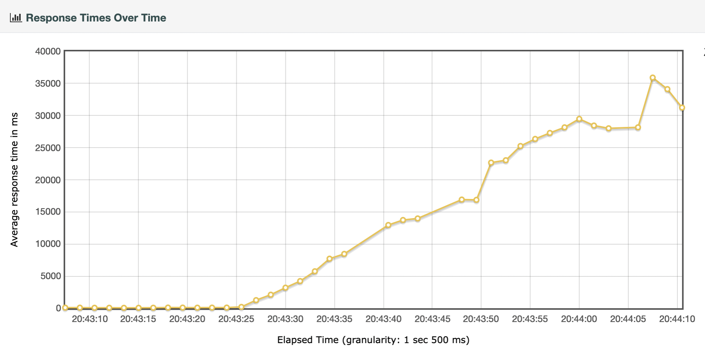
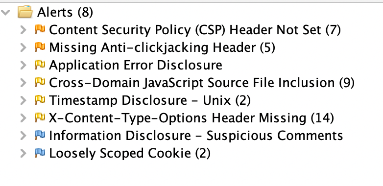
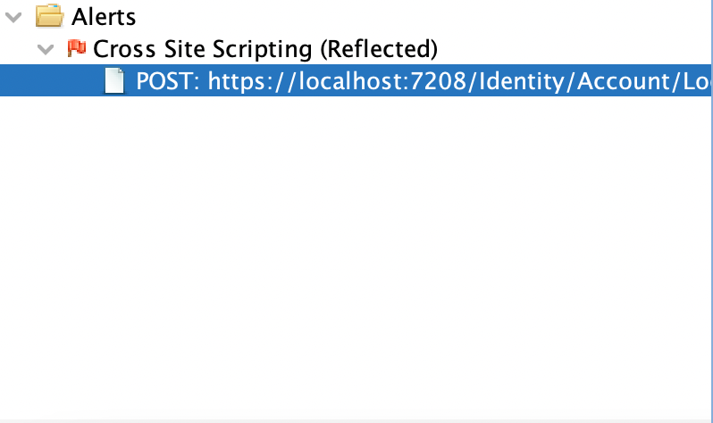

# InsideAirbnb

An app based on [insideairbnb](http://insideairbnb.com) that __does__ use https among other security & performance enhancements.

Using dotnet core 6 / 7 preview 2

* asp.net core backend
* blazor frontend

## To run API

1. Got to api subdir
2. copy `.env.example` to `.env` (and fill in the blanks)
3. copy `appsettings.json` to `appsettings.Development.json` (and fill in the blanks)
4. `docker compose up -d`
5. `dotnet run`

## Technical Requirements

### Must have

* Wordt gehost op het Azure Cloud Platform
* Maakt gebruik van ASP.Net Razor pages of MVC. Alleen in overleg met docent als er goede redenen zijn om hiervan af te wijken ✅ (blazor)
* Maakt gebruik van MSSQL Server (versie van Azure) ✅
* De applicatie moet veilig zijn. Gebruik de OWASP top 5 om de meest voorkomende onveiligheden op te sporen en af te dichten
* De applicatie is aantoonbaar highly-scalable. Er worden daarvoor performance tests als bewijsmateriaal opgeleverd (voor de performance-verbeteringen en daarna)
* Authenticatie en autorisatie via Azure B2C of IdentityServer4 (Authentication As A Service) ✅ (net core identity)
* Caching service via Redis ✅

### Would have

* Microservice architectuur
* Microservice orchestration met Kubernetes
* Blazor applicatie met SignalR ✅

## Functional Requirements

### Must have

* Registeren en inloggen ✅
* Filter op prijs ✅
* Filter op buurt ✅
* Filter op review ✅
* Kaart is clickable, details rechts op pagina, maakt gebruik van de mapbox API ✅
* Details per item waarop gefiltered is: #overnachtingen, #opbrengst in de maand. ✅
* Er moeten rollen toegevoegd en toegekend worden aan geregistreerde gebruikers. ✅
* Resultaten zoals trends, totalen, gemiddelden, etc. worden weergegeven in charts, alleen te bekijken voor ADMINS. Denk daarbij aan bv Gemiddelde beschikbaarheid per maand, gemiddelde beschikbaarheid per buurt, overzicht van gemiddelde huurprijs per buurt. Andere managementoverzichten zijn ook mogelijk, ga daarvoor op zoek naar online voorbeelden ✅

### Could have

* Locaties van zoekresultaat zichtbaar op kaart ✅
* Layout idem als insideairbnb.com ✅

## Architecture

## Performance

Voor performance is [ASP.NET Core Blazor performance best practices](https://docs.microsoft.com/en-us/aspnet/core/blazor/performance?view=aspnetcore-6.0) gevolgd.

Verder heb ik performance metingen gedaan volgens de instructies binnen deze course. Ook heb ik onderzocht wat de mogelijkheden zijn van het automatiseren van performance metingen d.m.v. azure load testing.

### Requirements

De applicatie zal voornamelijk gebruikt worden op READ (CRUD) operaties uit te voeren. De zwaarste query zal zijn: 

* alle listings ophalen uit de database voor weergave op de kaart

Er is vanuit de opdrachtgever geen hard limit gegeven, maar ik vind zelf 1 seconde maximaal acceptabel: het mag dus maximaal 1 seconde duren voordat de kaart met locaties ingeladen is.

### Timeline recording

Om eerst een goed beeld te krijgen van de laadtijden is het, naar voorbeeld van de workshop performance metrics, handig de timeline op te nemen.

Hieruit kunnen we opmerken dat de applicatie ongeveer 2 seconden nodig heeft om alle content op te halen en te renderen. Dat is nog niet binnen de 1 seconde die ik als doel gesteld heb: eens kijken wat we hieraan kunnen doen!

### Apache Jmeter

Jmeter gebruik ik hier o.a. om de z.g.h. 'operational ceiling' te bepalen. Dit heet ook wel: [Roofline model](https://en.wikipedia.org/wiki/Roofline_model)

Om het kort en bondig te houden maak ik hier alleen gebruik van de metric 'Response times over time'. Volledige rapporten zijn in de [repository](/doc/jmeter) te vinden.

Initiële meting (commit 1b36faf)

### Azure load testing

[What is Azure Load Testing Preview?](https://docs.microsoft.com/en-us/azure/load-testing/overview-what-is-azure-load-testing)

### Monitoring

Voor performance monitoring is gebruik gemaakt van prometheus & grafana. Standaard worden performance indicators als CPU usage, RAM usage aantal threads etc. bijgehouden. D

## Security

### Https

In distributievorm (docker) is gekozen geen https vanuit kestrel te serveren. In plaats daarvan is het aan te raden een proxy te gebruiken zoals nginx, traefik of iis. Dit kan vanuit hetzelfde interne netwerk, waardoor de onversleutelde poort niet open hoeft te staan naar buiten. Een alternatief is een edge dienst als cloudflare gebruiken, alleen is hier de verbinding tussen cloudflare en de bronserver niet encrypted. Mocht een potentiële aanvaller ooit achter de bronurl komen, is onversleuteld verkeer alsnog mogelijk met alle gevolgen van dien.

### OWASP ZAP

Een baseline scan (commit f450840) geeft:

Allereerst het probleem betreft CSP header ([docs](https://docs.microsoft.com/en-us/aspnet/core/blazor/security/content-security-policy?view=aspnetcore-6.0))

Na het oplossen van dit probleem in commit 1b36faf resteren de volgende issues:

However, owasp zap geeft aan dat: "Raised with LOW confidence as the Content-Type is not HTML" en als solution: "Use a vetted library or framework that does not allow this weakness to occur or provides constructs that make this weakness easier to avoid.
Examples of libraries and frameworks that make it easier to generate properly encoded output include Microsoft's Anti-XSS library, the OWASP ESAPI Encoding module, and Apache Wicket."

Nu gebruik ik binnen dit project .net 6 blazor, en valt het mij op dat microsoft's anti-xss library niet meer beschikbaar is sinds .NET 4.8.

Ik heb wat dieper gegraven om te kijken of dit een probleem vormt voor mijn applicatie, maar ik kom op het volgende:

volgens: [Threat mitigation guidance for ASP.NET Core Blazor Server](https://docs.microsoft.com/en-us/aspnet/core/blazor/security/server/threat-mitigation?view=aspnetcore-6.0#cross-site-scripting-xss)

"For a XSS vulnerability to exist, the app must incorporate user input in the rendered page. Blazor Server components execute a compile-time step where the markup in a .razor file is transformed into procedural C# logic. 

en

"User input rendered via normal Razor syntax (for example, @someStringValue) doesn't expose a XSS vulnerability because the Razor syntax is added to the DOM via commands that can only write text. Even if the value includes HTML markup, the value is displayed as static text. When prerendering, the output is HTML-encoded, which also displays the content as static text."

Omdat ik geen gekke constructies gebruik, en alleen de default implementatie in dit geval, kan ik a.d.h.v. het bovenstaande concluderen dat OWASP in dit geval terecht aangaf dat voorzichtigheid geboden is, maar er geen werkelijk probleem is. Mogelijk is de scanner niet in staat / geüpdatet om blazor applicaties te herkennen.

Hiermee zijn de gevonden OWASP ZAP vulnerabilities dus verholpen.

